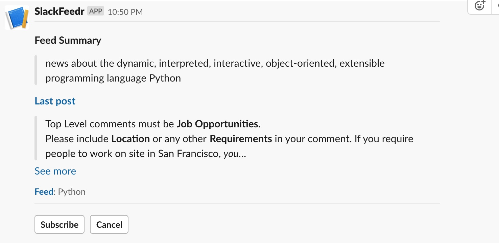

Initialization of SlackFeeder

# Helpful links
- https://www.pythonforbeginners.com/feedparser/using-feedparser-in-python
- https://api.slack.com

# Packages
 - HTMLSlacker
 - https://pythonhosted.org/feedparser/

# Thoughts
 - unique ID 
    --channel
    --user
    --workspace